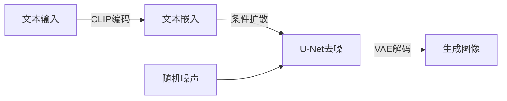
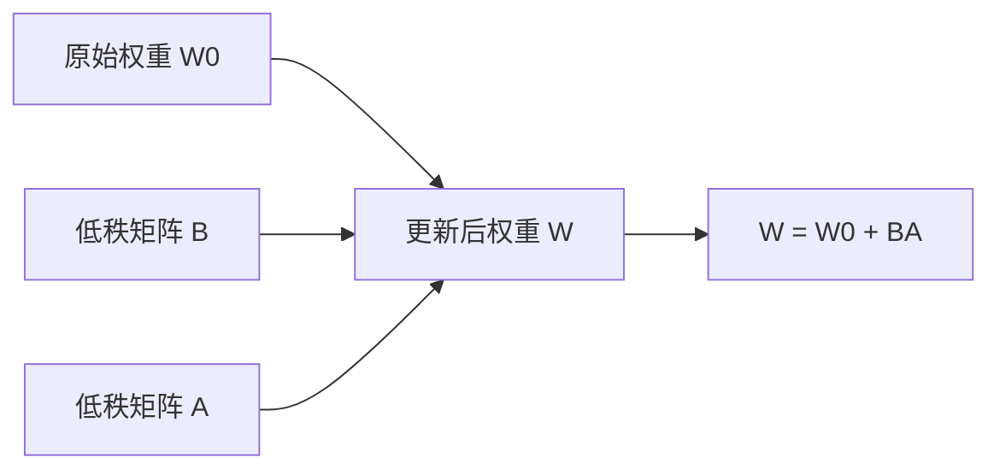

# 图像生成AI微调大信科风格图片项目介绍

本项目实现了基于Stable Diffusion的中文图像生成模型，包含模型训练和推理两个主要功能。项目使用LoRA（Low-Rank Adaptation）技术对中文Stable Diffusion模型进行微调，以实现大信科主题的图像生成效果。

## 1 项目结构

- `train_emoji.py`: 表情包风格模型训练脚本
- `train_poster.py`: 海报风格模型训练脚本
- `inference_e.py`: 模型推理脚本
- `pytorch_lora_weights.safetensors`: 训练后的LoRA权重文件

### 1.1 运行方法

1. 首先安装依赖库：

   `pip install -r requirements.txt`

2. 根据需要训练的图片风格，选择对应的训练脚本：
   - 表情包风格：将表情包数据集与`train_emoji.py`放在一起，运行：
     ```bash
     python train_emoji.py
     ```
   - 海报风格：将海报数据集与`train_poster.py`放在一起，运行：
     ```bash
     python train_poster.py
     ```

3. 训练完成后会输出对应的lora权重文件`pytorch_lora_weights.safetensors`，将其与`inference_e.py`放在一起，调整其中的prompt后运行：

   `python inference_e.py`

   就可以生成提示词要求的图片了。

## 2 技术原理

### 2.1 Stable Diffusion模型

Stable Diffusion是一个强大的文本到图像生成模型，它通过扩散过程将随机噪声逐步转换为符合文本描述的图像。本项目使用了中文版本的基础模型：`IDEA-CCNL/Taiyi-Stable-Diffusion-1B-Chinese-v0.1`。

#### 2.1.1 扩散过程原理

扩散过程包含前向扩散和反向扩散两个阶段：


##### 2.1.1.1 前向扩散过程

在时间步t，前向扩散过程通过以下公式逐步将图像转换为高斯噪声：

q(xₜ|xₜ₋₁) = N(xₜ; √(1-β)xₜ₋₁, βI)

其中：
- β 是噪声调度参数
- N 表示正态分布
- I 是单位矩阵

##### 2.1.1.2 反向扩散过程

反向扩散通过预测并移除噪声来重建图像：

p(xₜ₋₁|xₜ) = N(xₜ₋₁; μ(xₜ,t), Σ(xₜ,t))

其中：
- μ 是由神经网络预测的均值
- Σ 是协方差矩阵

#### 2.1.2 生成Pipeline



整个生成过程包括：
1. 文本编码：将输入文本转换为嵌入向量
2. 条件扩散：基于文本引导的去噪过程
3. 图像解码：将潜空间表示转换为最终图像

### 2.2 LoRA微调技术

LoRA是一种高效的模型微调方法，它通过在原始模型权重矩阵中添加低秩矩阵来实现参数高效的模型适配。其核心思想是将模型权重的更新分解为低秩形式：



#### 2.2.1 数学原理

给定原始预训练权重矩阵 W₀ ∈ ℝᵐˣⁿ，LoRA通过以下方式进行参数高效的微调：

W = W₀ + BA

其中：
- B ∈ ℝᵐˣʳ 和 A ∈ ℝʳˣⁿ 是低秩矩阵
- r 是秩的大小，通常远小于 min(m,n)
- BA 的秩最多为 r

在训练过程中，梯度更新公式为：

∇W = ∇B·A + B·∇A

主要特点：

- 只训练少量参数，保持模型主体不变
- 训练速度快，显存占用小
- 可以保存为独立的权重文件，方便切换不同的风格

## 3 训练过程

### 3.1 数据集准备

训练脚本使用自定义的`Text2ImageDataset`类来加载训练数据：

- 支持多种图像格式（PNG、JPG、JPEG等）
- 图像和文本标注需要一一对应
- 自动进行图像预处理和文本标记化

根据需要训练的风格，准备相应的数据集：
- 表情包风格：收集具有表情包特征的图片
- 海报风格：收集具有海报设计特征的图片

### 3.2 训练配置

- 使用LoRA配置：
  - rank(r) = 8
  - alpha = 16
  - 目标模块：["to_k", "to_q", "to_v", "to_out.0"]
  - dropout = 0.1

- 训练参数：
  - 学习率：1e-7
  - 优化器：AdamW
  - 训练轮数：5轮
  - 使用余弦学习率调度器

## 4 生成图片（inference_e.py）

### 4.1 主要功能

推理脚本提供了两个核心函数：

1. `load_lora_model`: 加载预训练的中文Stable Diffusion模型和LoRA权重
2. `generate_image`: 根据提示词生成图像

### 4.2 使用方法

1. 环境准备：
```bash
pip install torch diffusers transformers
```

2. 运行推理：
```python
# 示例代码
from inference_e import load_lora_model, generate_image

# 加载模型
pipe = load_lora_model('./pytorch_lora_weights.safetensors')

# 生成图像
images = generate_image(
    pipe,
    prompt="一只狮子",  # 中文提示词
    num_images_per_prompt=2,  # 生成图片数量
    seed=1000  # 随机种子
)

# 保存图像
for i, image in enumerate(images):
    image.save(f'生成图_{i}.png')
```

### 4.3 参数说明

- `prompt`: 中文提示词
- `negative_prompt`: 负面提示词，用于控制不想要的元素
- `num_images_per_prompt`: 每次生成的图片数量
- `guidance_scale`: 生成图像对提示词的遵循程度（默认7.5）
- `num_inference_steps`: 推理步数（默认50）
- `seed`: 随机种子，用于复现结果

## 5 注意事项

1. 确保有足够的GPU显存（推荐8GB以上）
2. 首次运行时会自动下载基础模型，需要稳定的网络连接
3. 生成的图像质量受提示词质量的影响，建议使用详细的描述
4. 默认添加了"卡通风格，暖色调，科技感"的风格提示词，可以根据需要修改
5. 根据需要的图片风格，选择对应的训练好的LoRA权重文件
